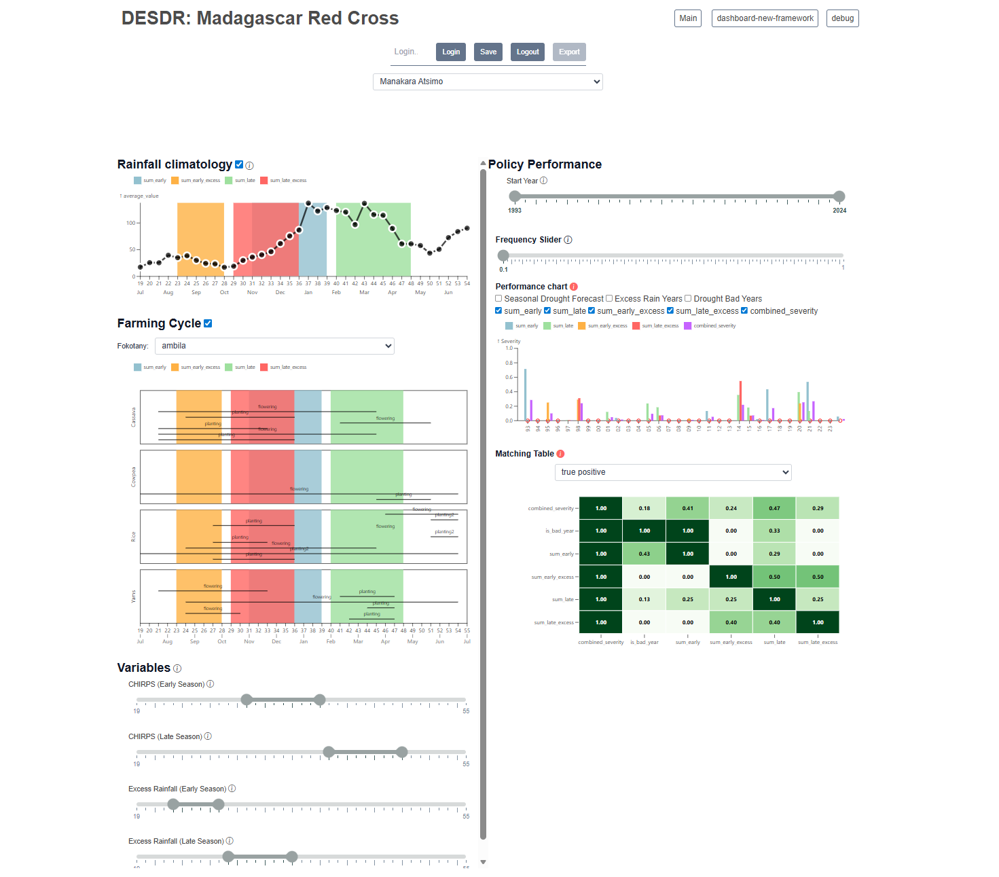
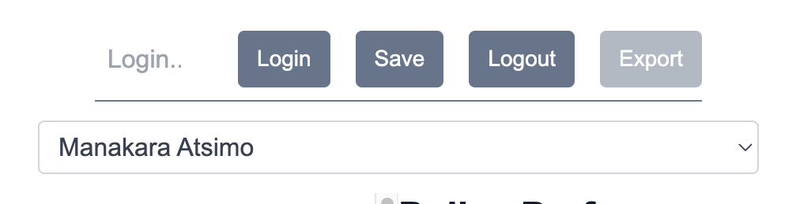
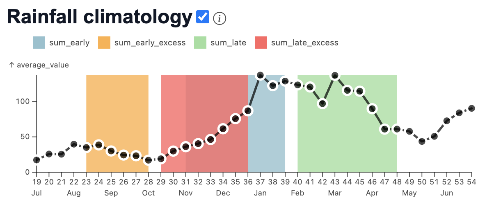
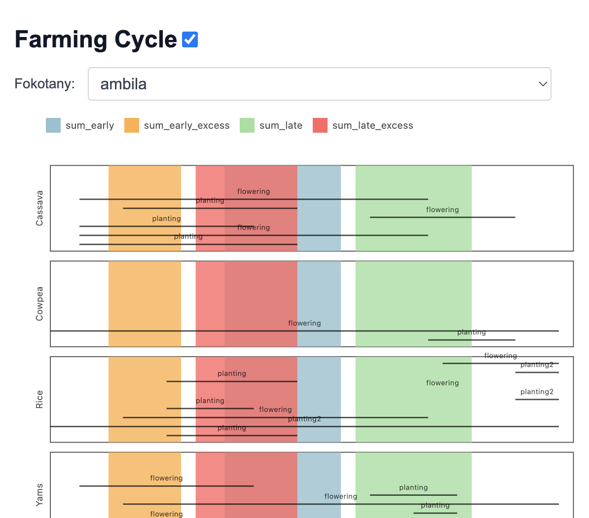
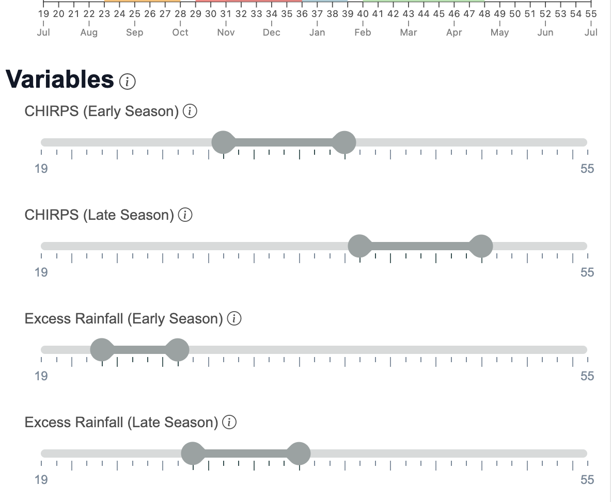
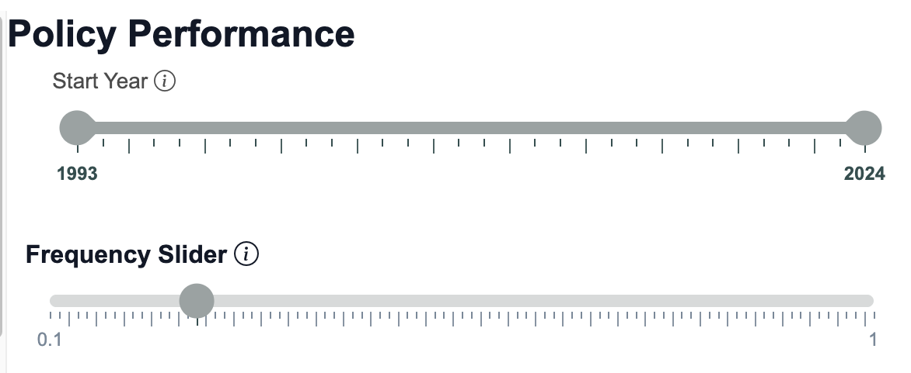
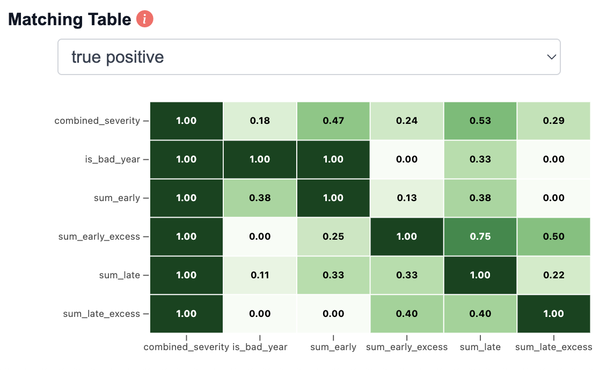

# 2b. Evaluating and Revising AA Triggers - Part 2

## 2 Co-Designing Revised AA Triggers

### 2.1 Sliders Tool User Guide

**To improve response to communities’ reported risks, we must consider how decisions about trigger measurement translate to outcomes.** 

Our goal is to maximize the cost-effectiveness of the EAP policy, by ensuring that resources are directed to the times and places where communities would have needed them the most. We do this through retrospective analysis of EAP policy design, translating communities’ knowledge into actionable statements about when and how to measure climate hazard.

 For an EAP policy to be effective and efficient, we want it to maximize the chances of triggering during communities’ worst years, and minimize the chances of triggering when it was not needed. 

A key operational decision is what time(s) of year to measure drought and excess rainfall. Some times of year are more important than others, particularly for agriculture, pastoralism and other climate-dependent livelihoods. Community-based analysis can help us make these crucial decisions. 

**To facilitate this analysis, we have designed the following Decision Support Tool (DST):**

https://columbia-desdr.github.io/Sliders-madagascar-red-cross/

This section describes the use of this tool, and some directed exercises on how it can be used to assess potential EAP policy designs. 

The DST analyses two hazards: Drought and excess rainfall. For each hazard, the DST takes district-level CHIRPS rainfall estimates, aggregates them over a user-selected time of year (“window”), and computes the historical years for which cumulative rainfall over that window would have been driest (drought) or wettest (excess). These are the years in which the potential EAP would have triggered.

The DST integrates data from the recently conducted community climate survey. This data is used to assess the adequacy of the potential EAP in two ways: 1\) the alignment of the windows with communities’ agriculturally crucial times of year, and 2\) the alignment of the historical trigger years with communities’ worst years for disaster impact. 

On the backend, the tool computes all of the information necessary to translate the user’s choices into EAP trigger parameters. The user can use the DST to explore different trigger design options, assess their adequacy, and save their choices in a database to return to late or use for further analysis. 

The following sections describe the user interface of the tool in greater detail. The tool is divided into three parts: The login and region selection bar at the top, seasonal analysis on the left hand panel, and historical analysis on the right hand panel. 

To toggle any element of the interface on or off, press the check mark next to it, and to see more information about what an element does, hover your mouse over the “i” icon next to its name. 

*Login and Selection Bar*

Type your name into the “Login…” field and then press “Login” to access the tool as your user account. Any previous choices you have saved using the tool will be loaded when you log in.   
If you wish to save the policy design for the region that you are currently viewing, press “Save”. If you wish to export your parameter choices and resulting data for further review or analysis, press “Export”.  
To select which region to analyze, use the drop-down menu. 

*Seasonal Analysis Panel*

The left panel presents information about the seasonal timing of EAP hazard measurements (“windows”), and how this timing relates to communities’ cropping practices and the rainfall progression of a typical season. 

The window timings are shown as colored overlays over each plot. They relate to early-season and late-season hazards for drought and excess, for a total of 4 seasonal windows for hazard measurement.

 All plots are organized around 10-day periods of the agricultural year, aka “dekads”. We define the agricultural year as running from July through the following June. 

This plot shows the climatology, i.e., the typical progression of rainfall, for the chosen district. 

This plot shows communities’ reported crop calendar, organized into the start and end of key activities \- planting and crop growth (flowering). If communities reported planting a crop more than once, its second planting timing is shown as “planting2”. If the community reported growing multiple crops, each is shown as its own panel. To view a different fokotany, use the drop down menu. 

These sliders allow the user to choose the sub-seasonal rainfall measurement periods, aka windows, for triggering the EAP. The first two sliders relate to drought, and the second two to excess rainfall. We allow for two windows for each hazard, one for the early season and one for the later season. Drag either end of the slider to change the start or end of the window. 

*Historical Analysis Panel*

The right-hand side of the DST shows a historical analysis of when each EAP hazard measurement window would have triggered action, and how these years align with communities’ reported worst years for drought and flood impact.   

Drag either end of the “Start Year” slider to change the first and last year for the historical analysis. 

Drag the “frequency” slider to change the targeted frequency of trigger events. For example, a frequency of .10 equates to the worst 10% of years, or equivalently, the worst 3 years out of the past 30\. The frequency slider determines the EAP trigger threshold as well as which community bad years are highlighted. The default frequency is 0.25.  

This chart shows the historical performance of the chosen EAP policy, based on the user’s timing and frequency input. The Y axis shows comparative severity (1=worst), and the X axis shows years. Each color on the chart corresponds to the severity of a drought or excess rainfall measurement period selected in the “Variables” pane (aka, a “window”). The “combined\_severity” color is an average severity over all four windows. 

To compare the historical EAP trigger years against communities’ reported impact years, select the “Excess Rain Years” and / or “Drought Bad Years” checkboxes. To compare these to the DGM seasonal drought forecast, select the “Seasonal Drought Forecast” checkbox. 

Finally, this table shows how well each source of historical data aligns with the other. The “benchmark” data source is shown in the columns of the table, and the “predictor” data source is shown in the rows. The number in each cell shows the matching metric. There are three matching metrics currently available: 

* True positive: Percent of benchmark “bad” years in which the predictor would have triggered.  
* True negative: Percent of benchmark “not bad” years in which the predictor would NOT have triggered.  
* Average matching: A weighted average of the true positive and true negative rates.

### 2.3 Revising Drought and Excess Triggers

**Now it’s your turn \- we will use this process to evaluate some potential ways of improving the drought and excess AA triggers.** 

**Moving from the near term to the longer term – how likely are we in the future to see more disaster events like the ones that communities remembered?** 

**What processes drive these extreme events, and how predictable are they?** 

 

