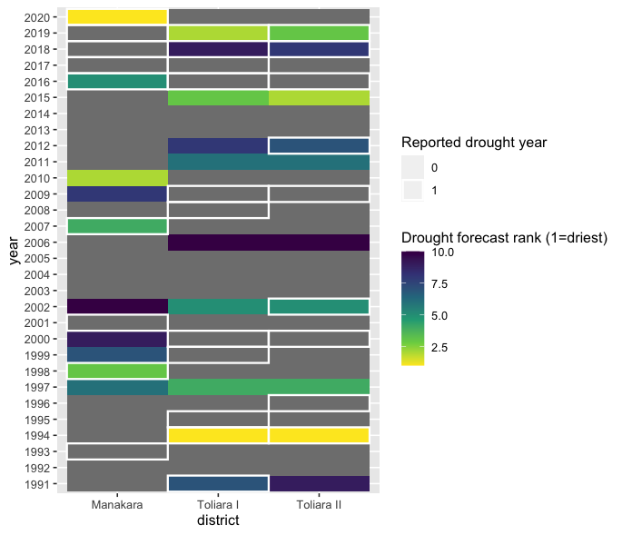
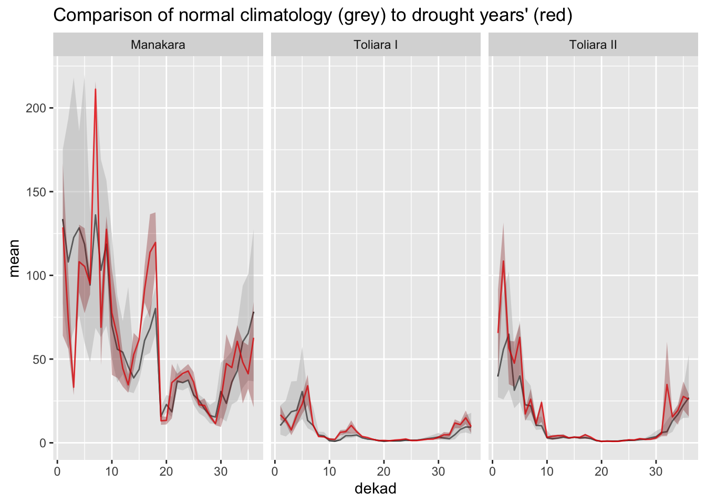
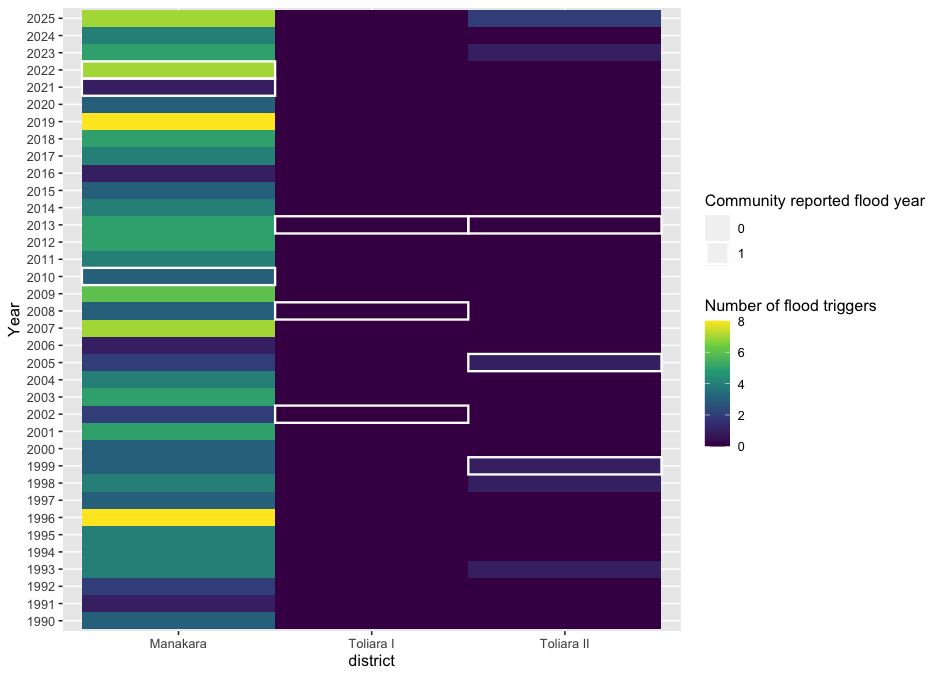
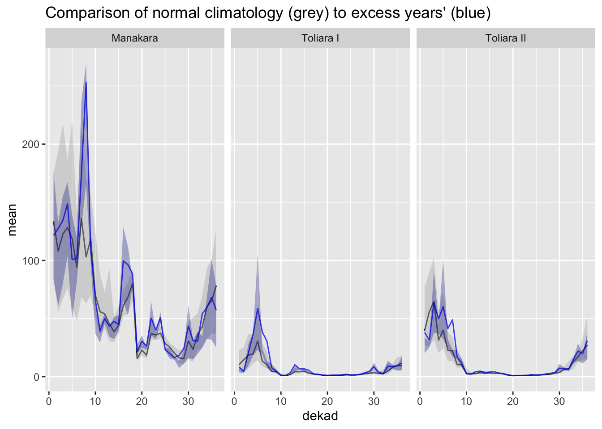

# 2a. Evaluating AA Triggers

## 1. Evaluation of Current MRCS AA Policies Using Community Data

**We can use simple methods of historical analysis to understand how effective AA triggers would have been at addressing communities’ reported worst years for each hazard.**  

### 1.1 Drought

Based on discussion with Red Cross staff, MRCS is currently finalizing the details of its drought EAP. However, MRCS is also an implementing partner in the World Food Programme (WFP)’s drought Anticipatory Action (AA) initiative, which covers much of southern Madagascar, including some of the areas of the southwest under the PPRM program.   
The WFP drought AA protocol is based on seasonal forecasts of drought developed by the DGM. A detailed guide to the protocol and its trigger rule can be found here.

Please note that the details of the WFP trigger rule for the coming 2026 OND (October-November-December) season are under discussion, and are not yet finalized.   
However, for reference, 

**The plot below shows the ranking of historical drought predictions’ from DGM’s seasonal forecast in each of the PPRM participating regions, with community bad years highlighted in white:**

**We can see that some of communities’ reported worst years for drought impact were associated with a dry season forecast, but many were not.** 

This highlights the importance of looking at sub-seasonal rainfall variation when measuring agriculturally important droughts, a point discussed further in the following section.

**Communities’ worst reported droughts are associated with sub-seasonal dry spells during agriculturally critical times of year.**

The plot below compares the distribution of rainfall in communities’ reported worst drought years in comparison to the long-term average progression of rainfall. The long-term average (“climatology”) in each 10-day period of the year (“dekad”) is shown in black, with the 25th and 75th percentiles of rainfall shown in the grey shaded range. Likewise, the red line and red shaded range present the average and extremes of the distribution of rainfall during communities’ reported worst drought years.

### 1.2 Excess Rainfall / Flood 

Based on analysis of the documents provided by MRCS, the trigger for the current flood EAP is based primarily on DGM’s two-week precipitation forecast. If the average forecasted precipitation over a district exceeds a cumulative 150mm, action is triggered. This trigger is supplemented with monitoring of stream gauges, daily rainfall, inundation modeling and local knowledge indicators of flood risk.

We do not have the full information necessary to assess the historical performance of the complete flood trigger rule described above. However, as a proxy, we can measure observed historical rainfall from the CHIRPS and compute how often the simple threshold of 150 cumulative mm over two weeks has been exceeded. 

**The below plot shows, in each district, the number of times that AA trigger threshold has been exceeded, with communities’ reported worst years for excess rain and flood highlighted in white:**  

Two things are apparent from this analysis: **First, the trigger almost never activates in Toliara.** However, as discussed in section 3, many communities in Toliara reported impacts from flood and excess rain, so a more tailored trigger threshold may be useful for those regions. **Second, in Manakara, the trigger activates at least once in almost every year since 1990**, and communities’ reported worst flood years do not appear to have much association with the number of triggers. 

As with drought,  this analysis motivates a more careful look at which times of the rainy season are most agriculturally important for communities, with a focus on directing EAP resources to where they are most needed. 

**Communities’ worst reported flood / excess events were associated with sub-seasonal rainy spells during agriculturally critical times of year.** 

The plot below compares the distribution of rainfall in communities’ reported worst excess rainfall years in comparison to the long-term average progression of rainfall. The long-term average (“climatology”) in each 10-day period of the year (“dekad”) is shown in black, with the 25th and 75th percentiles of rainfall shown in the grey shaded range. Likewise, the blue line and blue shaded range present the average and extremes of the distribution of rainfall during communities’ reported worst excess rainfall years.

**We can see that communities’ worst excess years in Manakara are associated with spikes of rainfall around March and May,** which are around the time of the planting period for maize and flowering period for rice, respectively.

Likewise, **communities in Toliara consistently identified excesses of rainfall around January and February,** which is around the time of the flowering period for maize there.

### 1.3 Tropical Cyclones

Based on analysis of the documents provided, MRCS’s EAP for cyclones is based primarily on DGM forecasts of cyclone direction and wind speed, up to 7 days in advance. Action is triggered when the forecasted wind speed exceeds 118-165km/h, and when the predicted storm track (subject to some margin of error based on historical track forecast skill) intersects key intervention areas. 

The trigger wind speed threshold was based on extreme value distribution modeling, and is meant to approximate a 1-out-of-5-year return period. 

**The below table is reproduced from the cyclones EAP, with PPRM region triggers and community bad years highlighted:**

Table 05: List of storms that reached the 118km/h threshold since 2010

| Year | Cyclones | Regions affected | Community bad year  |
| :---- | :---- | :---- | :---- |
| **2025** | Dikeledi, Jude | **Dikeledi**: Sava, Diana, et Sofia **Jude**: Sofia, Boeny, Melaky and Atsimo Andrefana |  |
| **2024** | Chido | Diana (Antsiranana) |  |
| **2023** | Freddy | **First landfall**: Vatovavy, Fitovinany, Menabe, Antsinanana, Amoron Mania, Haute Matsiatra  **Second approach**: Morombe, Menabe | **Yes (Manakara)** |
| **2022** | Emnati, Batsirai | **Batsira**i: Vatovavy, Fitovinany, Atsinanana, Atsimo-Atsinanana, and Analamanga **Emnati**: Southeastern Madagascar (Manakara, Farafangana, Vohipeno)  | **Yes (everywhere)** |
| **2019** | Belna | Northeastern/eastern Madagascar (Maroantsetra, Andilamena, Mandritsara)  |  |
| **2018** | Eliakim |  Northeastern/eastern Madagascar (Maroantsetra, Andilamena, Mandritsara)  |  |
| **2017** | Ava, Enawo | **Ava**: Toamasina, Analanjirofo, Alaotra-Mangoro, Analamanga, Vatovavy-Fitovinany **Enawo:** Eastern and central Madagascar (Antalaha, Maroantsetra) |  |
| **2014** | Hellen | Northwestern Madagascar (Boeny, Melaky)  |  |
| **2013** | Haruna |  Atsimo-Andrefana (southwest)  | **Yes (Toliara)** |
| **2012** | Giovanna |  Eastern coast (Andevoranto, Brickaville, Vatomandry), Central Highlands (Antananarivo, Moramanga)  |  |
| **2011** | Binguiza |  Analanjirofo, Sofia, Boeny, Melaky, Menabe, Fitovinany, Atsimo-Atsinanana  |  |

Between 2010 and 2023 (14 years), 9 storms reached the trigger threshold (Table 3). However, because wind speeds are, on average, underestimated by the forecast models, the trigger is unlikely to be met as frequently as once in every 9 years.

**We can see that all of communities’ reported worst years for storms in recent history would have triggered early action.**

**What can we conclude about the performance of current AA triggers from this community-driven historical assessment?**

 

