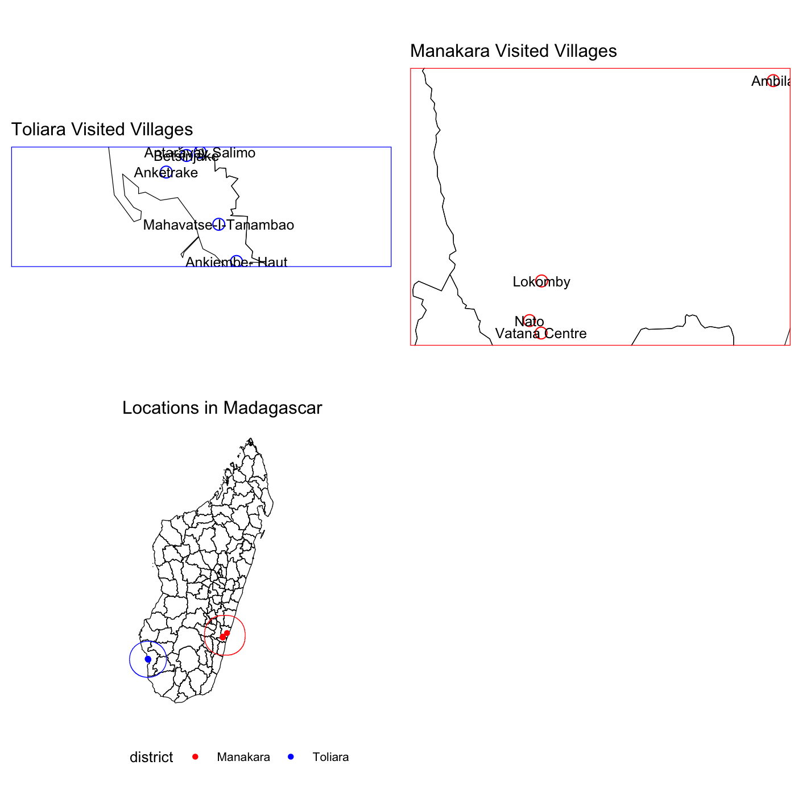
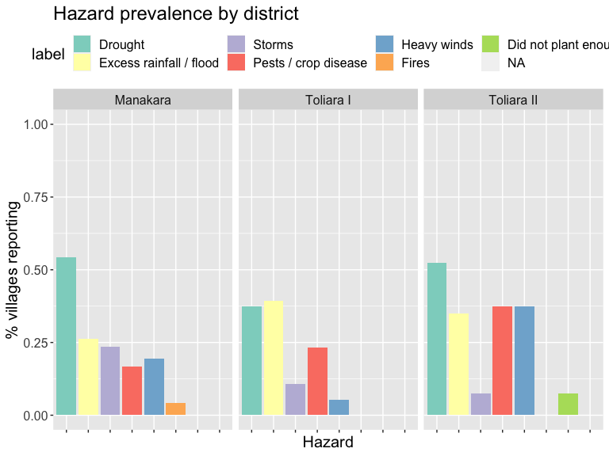
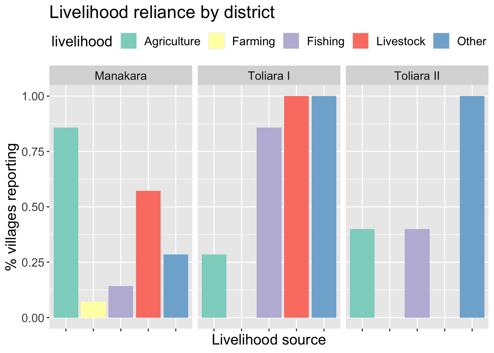
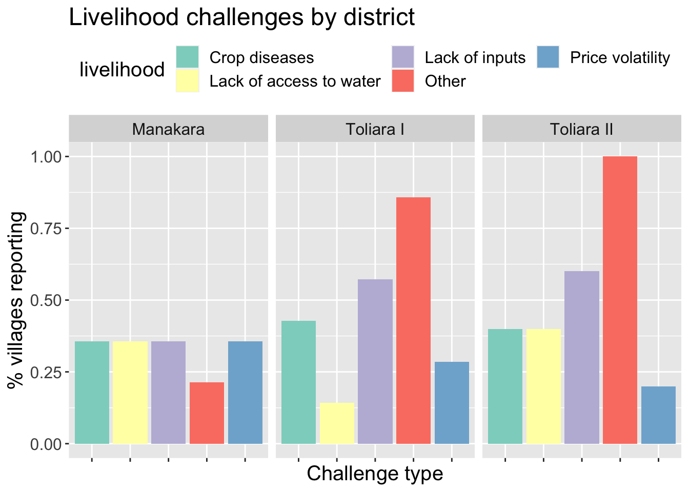
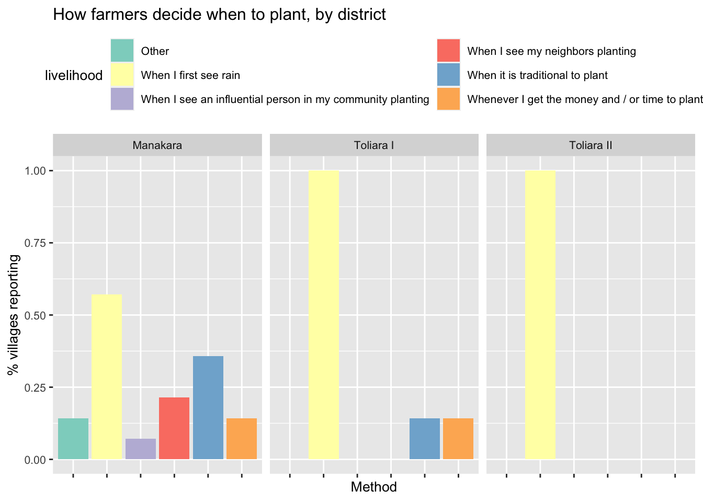
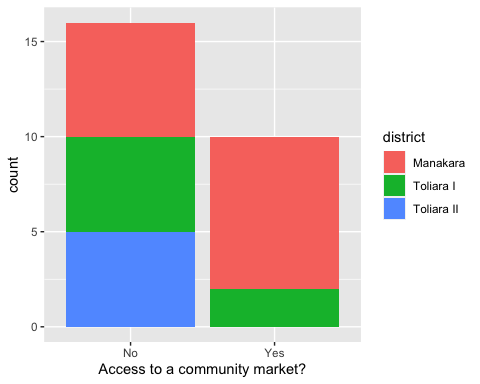

# 1. Introduction & Goal Setting

## 1. Presentations and Introductions

**The goal of this project is to bring together anticipatory action and climate adaptation.**

Through this action-research project, CU, the IFRC and the MRCS seek to develop the capacities of selected communities around climate risk knowledge for locally led anticipatory action and climate change adaptation. Ultimately, the work aims to strengthen the resilience of local communities in the face of evolving risks, as well as to contribute to national disaster risk management efforts in Madagascar. 

The object of this project is to develop a methodology and related toolkit to collect community knowledge around climate change and how risk is evolving in the targeted areas and translate it into climatic data that can be used to inform broader climate science and the work of the metrological authorities (DGM and BNGRC) in determining triggers for anticipatory action. 

**This week, we will review the co-design toolkit for the project together, and refine it.** 

CU has developed a preliminary version of the action-research toolkit to assess community climate risk experiences, translate them into anticipatory action trigger policies, and relate these policies to climate change adaptation and risk scenarios. Now, there is a need to work through this preliminary toolkit with IFRC and MRCS programme and policy staff in order to build their capacity, receive their feedback and finalize the toolkit based on their input. 

**Objectives**

Activities discussed this week:

- Community Knowledge Translation (Deliverable C)  
- Evolving-Risk Mid-Term Scenarios (Deliverable D)  
- Community-Led Adaptation Measures (Deliverable E)  
- EAP Revision Toolkit and Repository (Deliverables, F, G)

The key activities that we plan to do during the co-design workshop include:

* Reviewing the results of the community data collection and translating them into AA choices, strategy and orientation (Deliverable C),   
* Reviewing medium-term scenarios for climate change and variability in Madagascar, and relating them to community impacts via Household Economy Analysis (Deliverable D),   
* Reviewing potential adaptation options using the Household Economy Analysis framework, including how to discuss them with communities using scenario exercises, (Deliverable E),   
* Reviewing and updating the community survey instrument, with a focus on potential follow-up activities for communities coming out of the workshop (Deliverables F, G).

## 2. Opening Goal-Setting Exercise

**Long-term climate adaptation requires protection against near-term risk** 

The southern region of Madagascar is a highly complex risk environment characterized by recurrent droughts, erratic rainfall, land degradation, chronic food insecurity, making it one of the country’s most climate-vulnerable regions. Livelihoods in the South remain heavily dependent on rain-fed agriculture, agro-pastoralism, livestock rearing, seasonal labor, and natural resources, all of which  are highly sensitive to climate uncertainty and repeated shocks[^1]. Madagascar’s National Adaptation Plan (NAP), finalized in 2021-2022, under the guidance of the UNFCCC, identifies Le Grand Sud as one of the country’s priority climate vulnerability areas[^2]. The NAP focuses on strengthening governance, sectoral action (agriculture, livestock, fisheries and health sectors), and financing adaptation. The country's key adaptation priorities include climate-smart agriculture, water management, ecosystem restoration, rural resilience, and ecosystem-based adaptation approaches aiming at strengthening communities facing recurrent drought and climate variability.

Madagascar has made important progress in strengthening climate risk governance through its National Adaptation Plan (NAP), disaster risk reduction (DRR) initiatives, participation in the African Risk Capacity (ARC) mechanism[^3], and its engagement with the Global Shield against Climate Risks[^4]. However, significant implementation and operational capacity challenges remain, particularly in highly vulnerable regions such as the South. Recurrent shocks, limited resources, and institutional constraints continue to make it difficult to fully translate national adaptation priorities into sustained local resilience outcomes. In this context, strengthening the operational integration between adaptation planning, climate risk management, early warning systems, and anticipatory action mechanisms may help improve the country’s ability to protect livelihoods before shocks escalate into humanitarian crises.

**What actions do you think communities in southern Madagascar could take to adapt? What is the Malagasy Red Cross currently doing in this area, and what would you hope to do?** 

**Next, we will discuss what communities told us about their climate risks.** 

## 3. Initial Findings from Community Climate Survey 

**Red Cross staff and volunteers conducted focus group discussions in 13 communities across Toliara and Manakara to understand communities’ climate risks and how to assess them.** 

**We found that drought was the most frequently mentioned hazard in most villages, followed by excess rainfall.** 

Toliara has been the most directly impacted by storms, while Manakara appears to be more prone to localized excess rainfall events.This therefore confirms the need for differential hazard responses, as livelihood risk varies significantly over different ecological zones. 

Communities provided detailed information on their recollected historical worst years for each hazard (discussed in the following section). 

**We found that some communities relied on rice farming, while others relied on pastoralism and fishing. Different geographic areas have reliance on different livelihoods, and face different climate risks.** 

Regarding livelihoods, communities in Manakara were much more likely to rely on farming as their main source of livelihood, to grow rice, and to plant multiple times throughout the year. In contrast, communities in Toliara rely much more heavily on pastoralism, fishing and maize farming. “Other sources” listed predominately mentioned charcoal making, salt making, handicrafts, and casual labor in towns.

“Other” challenges listed predominately mentioned flooding and excess rainfall, theft, and water pollution. This highlights that livelihood vulnerability is shaped by both climatic and non-climatic stressors requiring integrated resilience planning.

**When deciding when to plant, nearly all communities reported relying on the first signs of rain and / or customary methods, suggesting some potential for benefit from forecast information and planting advisory services.** 

Most communities reported that they made predictions about the coming season on the basis of traditional bio-indicators, such as the presence of certain species or the appearance of the night sky and the sea. Climate change may threaten the reliability of these indicators, again pointing to the potential for advisory services. This means blending scientific forecasts with trusted indigenous forecasting systems may improve community uptake and trust in advisories. 

**When asked about challenges to their livelihoods, most communities identified lack of agricultural inputs as a key challenge, suggesting some potential for policies to alleviate these constraints.** 

Inputs constraints appear to be both financial and risk-related, suggesting opportunities for  bundled support mechanisms. In Manakara, most communities reported having access to a market, so low input adoption may be due to other constraints, such as lack of income and / or unsecured risk from climate variability. Adaptation policies could focus on alleviating these constraints.  In Toliara, most communities said they did not have access to a market, so adaptation policies might be better focused on other areas, such as maintaining pastoral livelihoods.

**Communities reported unequal access to markets.** 

**When it comes to strategies for coping with climate shocks, many communities mentioned irrigation.** 

Adaptation policy might focus on promoting irrigation so that communities have to rely less on reported negative coping strategies, such as taking out loans or selling assets. It is more important to protect productive assets before shocks occur which remain essential in preventing negative coping cycles. 

**This community knowledge gives us a basis for evaluating AA triggers.** 

[^1]:  https://fews.net/southern-africa/madagascar/livelihood-description/december-2013/print 

[^2]:  https://unfccc.int/sites/default/files/resource/PNA-Madagascar.pdf

[^3]:  https://www.arc.int/news/fight-against-climate-change-arc-now-covers-floods 

[^4]: https://irff.undp.org/sites/default/files/2024/Nov/12-madagascar_0.pdf 

 

