# 3a. Understanding the State of the Science on Climate Change in Madagascar

## 1 What Models Can and Can’t Tell Us

**The use of global climate model projections for humanitarian decision-making must be fit for purpose.** 

While the tendency of many climate risk assessments is to look at global climate models’ projected changes of average precipitation or temperature decades into the future, this information is not actionable for most humanitarian applications[^5]. A focus on projected averages overlooks the contribution of year-to-year variability[^6], and thus elides the most consequential ways in which the climate acts on rural peoples’ livelihoods[^7]. 

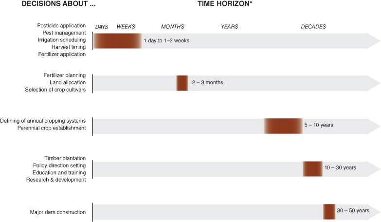

Timescales for different climate-informed decisions (Nissan et al 2019\)

**To put it another way, climate change is not a simple one-way effect; instead, it acts more like a multiplier on existing patterns of year-to-year weather risk.** 

Precipitation extremes are likely to become more extreme (in both directions), seasonality is likely to become less predictable, and increased temperatures mean that droughts and floods are both likely to hit harder when they arrive. At the same time, the patterns of precipitation in Madagascar will remain dominated by year-to-year sources of variability such as the El Nino Southern Oscillation (ENSO) and Indian Ocean Dipole (IOD). 

**There is thus a need to better understand how communities can adapt to such variability today, in order to prepare for a more volatile climate tomorrow.** 

The scenario exercises presented in this report are an attempt at translating that understanding into actionable adaptation decisions at the community level. We have found that when climate risks and choices are presented clearly and honestly, rural communities are more likely to make the adaptation decisions that are suitable to them[^8]. 

With that motivation in mind, this section presents an overview of the state of the science on likely changes to the climate in Madagascar, drawing on the World Bank Climate Change Knowledge Portal[^9] as well as a review of the academic literature. 

## 2 Likely Changes to Heat and Precipitation

### 2.1 Climate Change Effects

**Anthropogenic climate change is likely to increase average temperatures and shorten the length of the rainy season[^10] over southern Madagascar[^11].** 

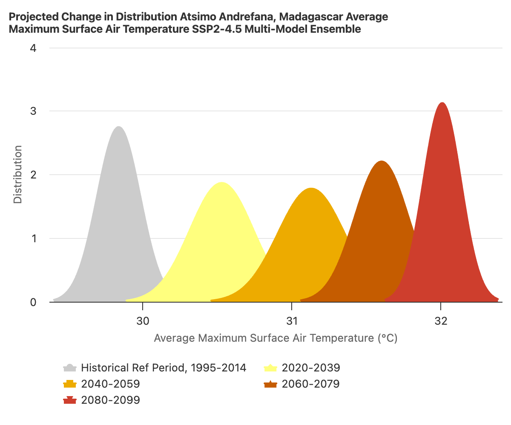
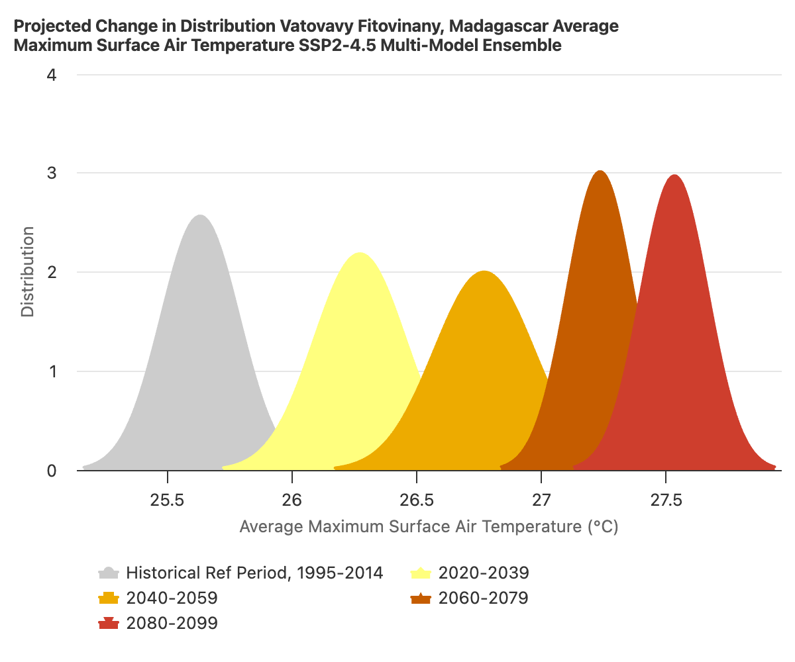  
Projected mean temperature changes, RCP4.5 (World Bank Climate Knowledge Portal)  

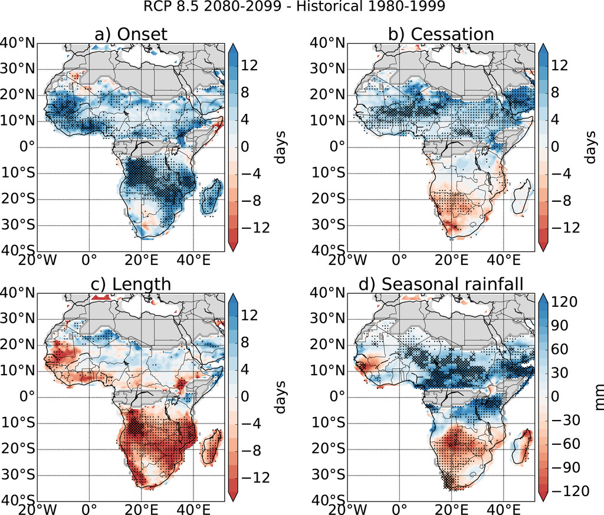  
Projected changes in length of primary rainy season (Dunning et al 2018\)

These changes are linked to shifts in the position of the tropical rain belt (ITCZ) which occur in most model projections**[^12]**. These changes are likely to translate to lower moisture availability for crops and rangeland[^13]. The fingerprint of these changes is already detectable in recent years[^14]; however, their full extent is not likely to emerge until the middle of the century and the long-term magnitude of the changes is highly uncertain. 

**We may observe unprecedented low and high extremes in rainfall as a result of climate change,** due to the increasing moisture capacity of the air under warming as well as the potential ways in which climate change may act as a multiplier on existing sources of decadal climate variability[^15]. In southern Madagascar, we observe the greatest potential for unprecedented extreme precipitation events (in both directions) around Dec-Jan. These predicted extreme conditions are similar to those observed during communities’ worst reported droughts in the recent past, and coincide with the rice planting season[^16]. **We are also likely to see an increase in the possibility of temperatures hazardous for human health (\>35c)** during the austral summer. 

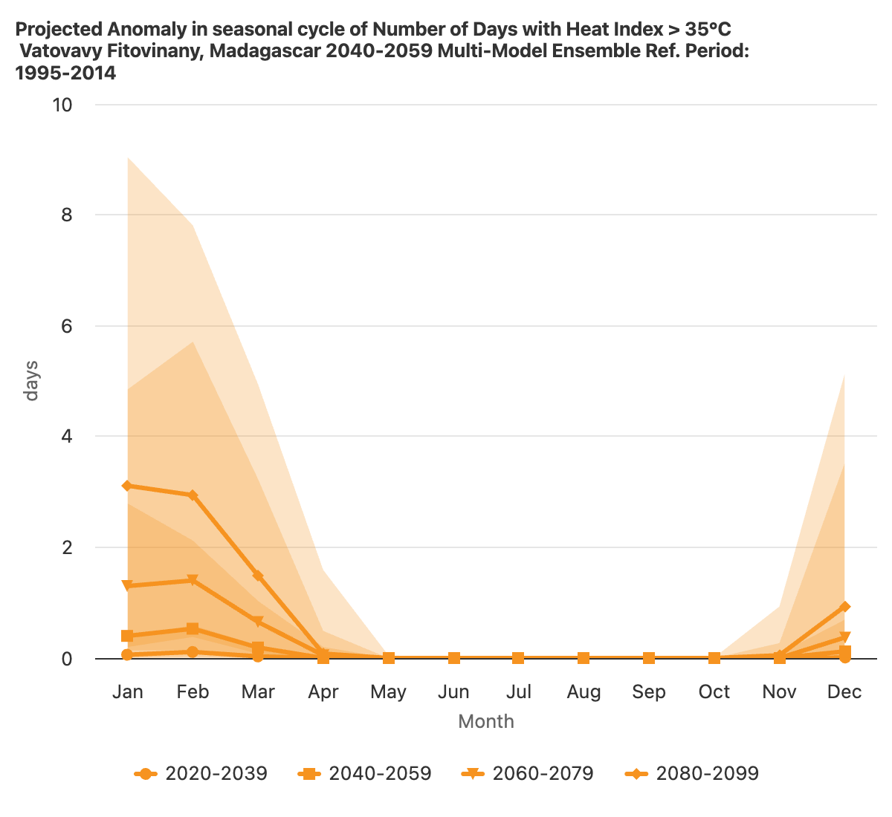
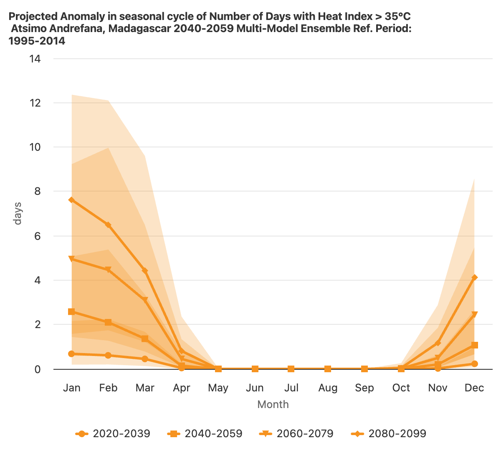
Projected changes in extreme temperatures, RCP4.5 (World Bank Climate Knowledge Portal)

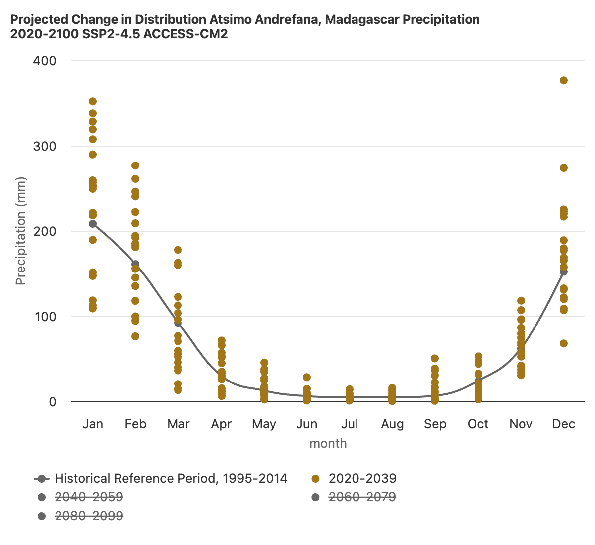
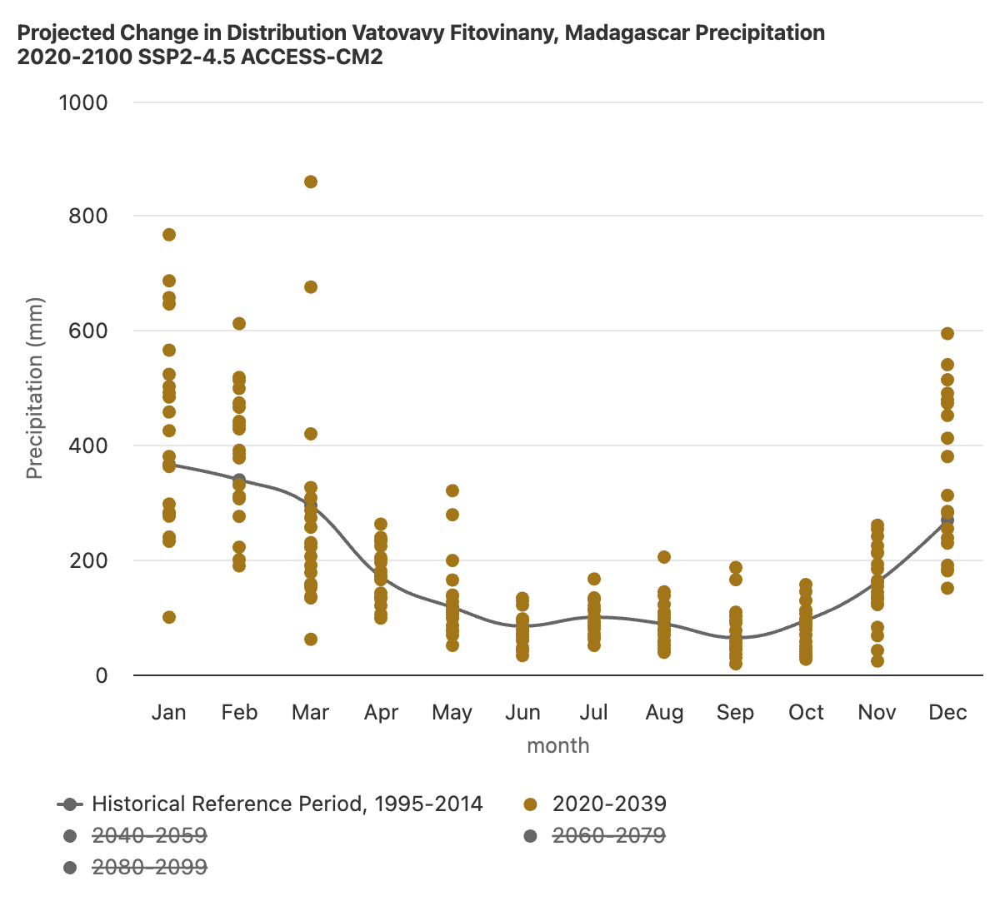
Projected medium-term variability in rainfall, RCP4.5 (World Bank Climate Knowledge Portal)

### 2.2 Decadal Processes

**At the same time that we observe emerging changes in the long-term patterns of precipitation and temperature as a result of climate change, rainfall in southern Madagascar remains dominated by year-to-year patterns of variability[^17].** 

The most significant of those are IOD and ENSO[^18]. Both affect precipitation over southern Madagascar, but ENSO has a greater contribution in the southwest, while IOD has a greater contribution in the southeast. IOD has a strong effect on both extreme high and low precipitation events[^19], while ENSO mainly affects the likelihood of drought (greater during an El Nino year)[^20]. Many of communities’ reported worst droughts in the recent past were ENSO events. At the same time, while ENSO and IOD may act as limiting factors on total available seasonal precipitation, they are only somewhat related with subannual dry[^21] and wet spells[^22]. We can observe this in the fact that only some of communities’ recollected worst droughts were during overall dry seasons. When ENSO and IOD interact, the likelihood of droughts like the major one in 2019-2021 increase[^23] greatly. 

Relationship between rainfall and IOD (Randiratsara et. al. 2022\)

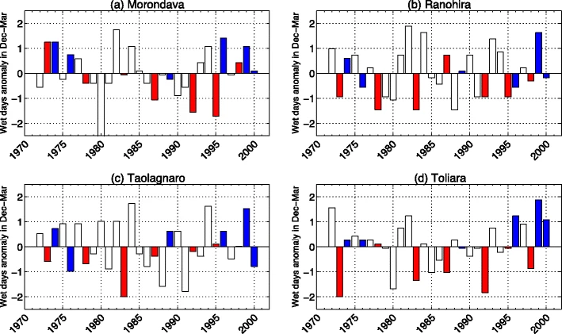
Relationship between rainfall and ENSO (Randriamahefasoa and Reason, 2017\)

**ENSO and IOD, and their resulting effects on seasonal total precipitation over southern Madagascar, can be predicted with decent skill 1-3 months in advance.** DGM is working with Columbia to develop tailored drought alert forecasts based on this principle. 

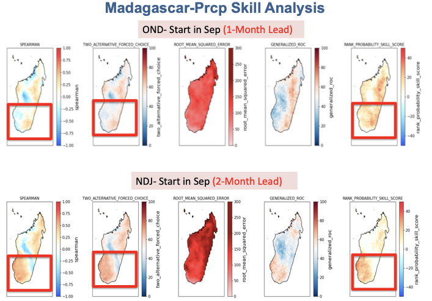 
Seasonal forecast skill for OND and NDJ (DGM & Azhar Ehsan, Columbia) 

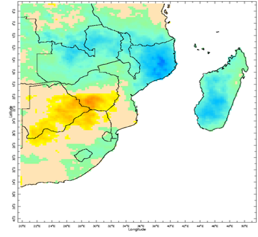
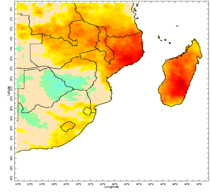
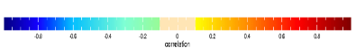

Correlation of dry spells (left) and wet spells (right) frequency with total seasonal precipitation (DGM & Azhar Ehsan, Columbia) 

**ENSO and IOD have been observed to have major impacts on crop and rangeland productivity in southern Madagascar[^24].** Seasonal decreases in soil moisture are also likely to have an effect on water availability for irrigation, and thus reduce the productivity of rice[^25]. 

**ENSO has also been observed to have an impact on vector-bourne diseases in Madagascar.** The main observed pathway for this effect is in the increase in livestock migration during droughts[^26]. On the other hand, flooding during wet years is also likely linked to an increase in vector-bourne disease outbreak, but these extremes are less predictable on a seasonal timescale. 

## 3. Likely Changes to Cyclones 

### 3.1 Climate Change Effects

**The impact of anthropogenic climate change on cyclone incidence and intensity in Madagascar is uncertain.** 

There is not clear consensus across models and scenarios on either aspect of projected cyclone hazard. At the same time, that does not mean that the likeliest project outcome is no change. **Instead, it means that there are a few different potential regional storylines of how climate change will affect cyclones, which point in countervailing directions.** 

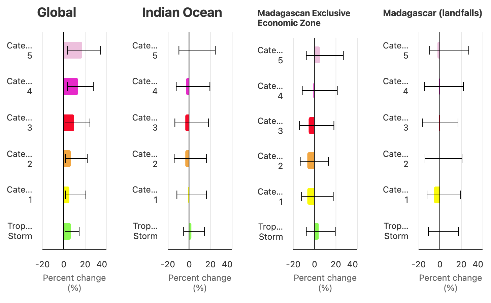
Projected changes in storm incidence, RCP4.5, 2035-2064 (World Bank Climate Knowledge Portal)

Per Mindlin et al (2020)[^27], the two main drivers of potential changes in cyclone incidence are “the enhanced warming of the tropical upper troposphere” on the one hand, and “the strengthening of the stratospheric polar vortex” on the other. Mindlin et al (2020) finds that in storylines of potential climate change effects, “the response to tropical warming leads to a strengthening of the midlatitude westerly winds, whilst the response to a delayed breakdown (for DJF) or strengthening (for JJA) of the stratospheric vortex leads to a poleward shift of the westerly winds and the storm tracks”. Together these two drivers explain 50-60% of cyclone variance in the region. In the first storyline, the incidence of cyclones in the region increases, while in the second, it decreases**.** These storylines are associated with a strong increase or weak decrease in overall DJF precipitation, respectively, while JJA precipitation weakly decreases under all storylines. 

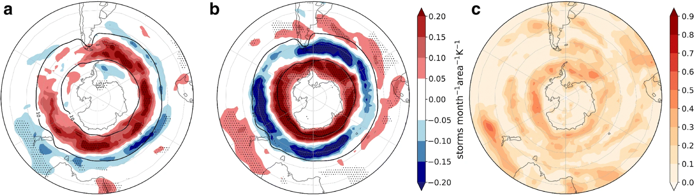 
Diverging storylines for future cyclone density \- (a) troposphere warming, (b) stratospheric vortex, (c) correlation between between SV and storm density (Mindlin et al 2020\) 

**In addition to the incidence and intensity of storms, climate change may affect their potential geographic reach as well[^28].** Per ongoing work from the Red Cross REPRESA project[^29], potential storylines of unprecedented extremes include the following:

- An average strong storm forecasted with a wide range of possible landfall locations, at the 7-day lead times needed for prepositioning.   
- A storm initially forecasted to not be strong enough to reach the trigger, but then at a shorter lead-time rapidly intensified   
- A storm forecasted to make two landfalls, the first in the northeast more certain, the second in the southwest more uncertain, but with a more vulnerable population. 

Cyclones not only impact property and crops, but also have multidimensional effects on food insecurity and health. **Community self-help has the potential to mitigate these impacts[^30].**

### 3.2 Decadal Processes

**Cyclones are less directly tied to seasonal sources of variability than precipitation is.** At the same time, these processes do have some effect on cyclone formation. Per Matyas (2014)[^31], “More TCs formed in the equatorward (poleward) sections of the channel when \[IOD was\] negative (positive). Trajectories of TCs forming north of 18° S tended to be curved and initially move south or southwest while experiencing easterly vertical wind shear and higher SSTs while those south of 18° S moved fairly straight from west to east over lower SSTs and strong westerly vertical wind shear. Landfall tended to occur over Madagascar when the MJO was in position to enhance cyclogenesis over the channel… ENSO did not exhibit statistically significant relationships with formation frequency, location, or track shape.”

## 4. How Can Community Feedback and Science Inform Each Other  

**Community assessments can tell us what important aspects of climate change to focus on.** At the same time, the science can also tell us how to talk about potential climate change scenarios with communities, and how to stress-test their potential effects[^32]. 

**What effects of climate extremes have you observed in southern Madagascar?** Do you see ways in which these extremes are getting worse, or less predictable? What do these extreme events mean for the community-led adaptation possibilities we identified on day 1?

**Increased bad year losses mean that there is a greater need to rely on a range of adaptation strategies to produce more in a good year, and manage risk.** The next section breaks down those impacts and opportunities on the community scale.

[^5]:  https://doi.org/10.1002/wcc.579

[^6]:  https://doi.org/10.1073/pnas.2208095119

[^7]:  https://doi.org/10.1093/pnasnexus/pgac009

[^8]:  https://doi.org/10.1080/00220388.2018.1554207

[^9]:  https://climateknowledgeportal.worldbank.org/country/madagascar

[^10]:  https://doi.org/10.1175/JCLI-D-18-0102.1

[^11]:  https://doi.org/10.1038/s41561-025-01898-8

[^12]:  https://doi.org/10.1175/JCLI-D-18-0102.1

[^13]:  https://doi.org/10.1029/2021GL097231

[^14]:  https://www.pnas.org/doi/full/10.1073/pnas.1618082114 

[^15]:  https://link.springer.com/article/10.1007/s00382-004-0460-7

[^16]:  https://www.nature.com/articles/s41612-024-00583-8

[^17]:  https://www.worldweatherattribution.org/wp-content/uploads/ScientificReport_Madagascar.pdf 

[^18]:  https://wiki.iri.columbia.edu/index.php?n=FbF.EnhancingSeasonalForecastingSkillsATrainingWorkshopInMadagascarFebruary2025InPerson

[^19]:  https://link.springer.com/article/10.1007/s00704-022-03950-8

[^20]:  https://link.springer.com/article/10.1007/s00704-015-1719-0

[^21]:  https://journals.ametsoc.org/view/journals/mwre/144/5/mwr-d-15-0077.1.xml

[^22]: https://wiki.iri.columbia.edu/index.php?n=FbF.EnhancingSeasonalForecastingSkillsATrainingWorkshopInMadagascarFebruary2025InPerson

[^23]:  https://www.sciencedirect.com/science/article/pii/S2212094724000847

[^24]:  https://www.mdpi.com/2072-4292/10/7/1038

[^25]:  https://www.mdpi.com/2072-4292/14/5/1223

[^26]:  https://journals.plos.org/plosntds/article?id=10.1371/journal.pntd.0001465

[^27]:  https://link-springer-com.ezproxy.cul.columbia.edu/article/10.1007/s00382-020-05234-1

[^28]:  https://www-sciencedirect-com.ezproxy.cul.columbia.edu/science/article/pii/S2468312424000178

[^29]:  https://www.anticipation-hub.org/Documents/Reports/Future_forecast_stories.pdf 

[^30]:  https://www.researchsquare.com/article/rs-9349944/v1

[^31]:  https://ui.adsabs.harvard.edu/abs/2014AMS....9433634M/abstract

[^32]: https://www.anticipation-hub.org/Documents/Training_and_Educational_Material/Toolkit_for_anticipatory_action_in_fcv_settings/AA_in_FCV_toolkit_Stress_testing_March_2025.pdf

 

