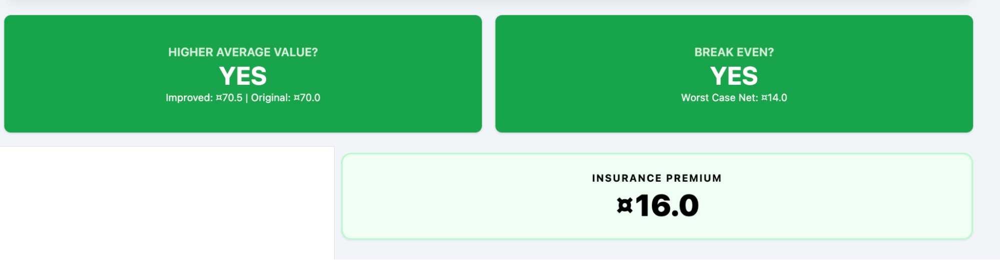
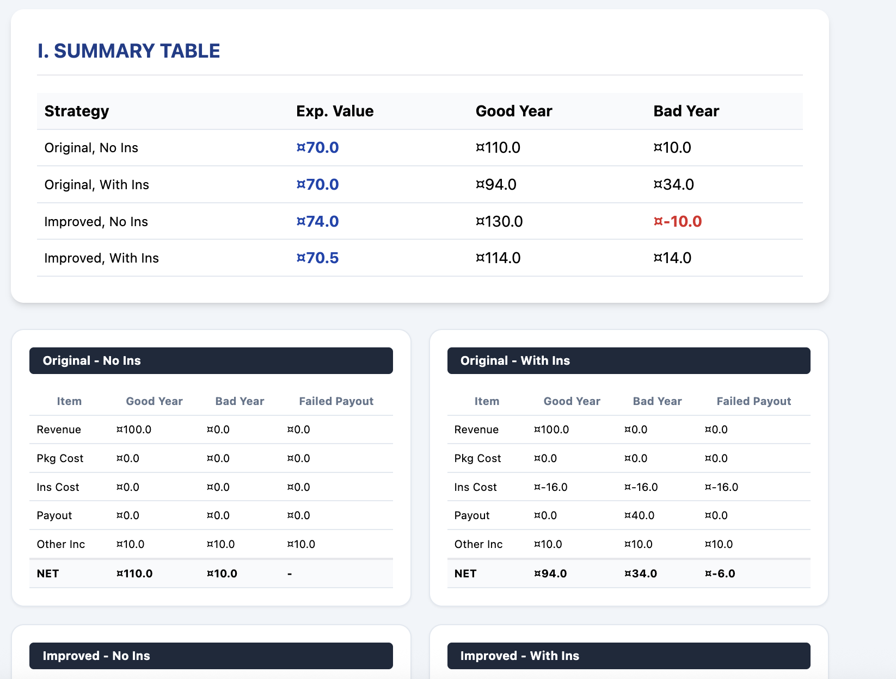
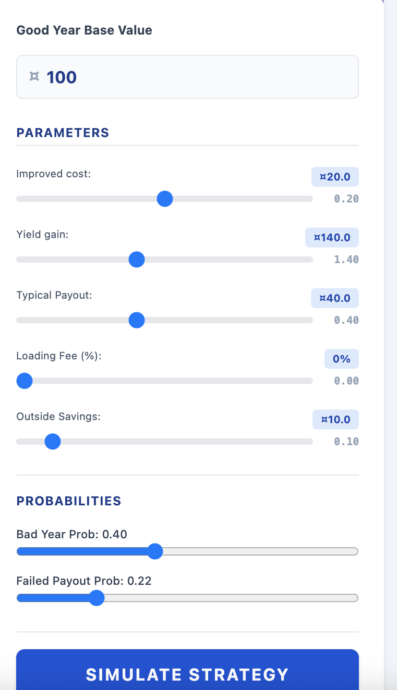
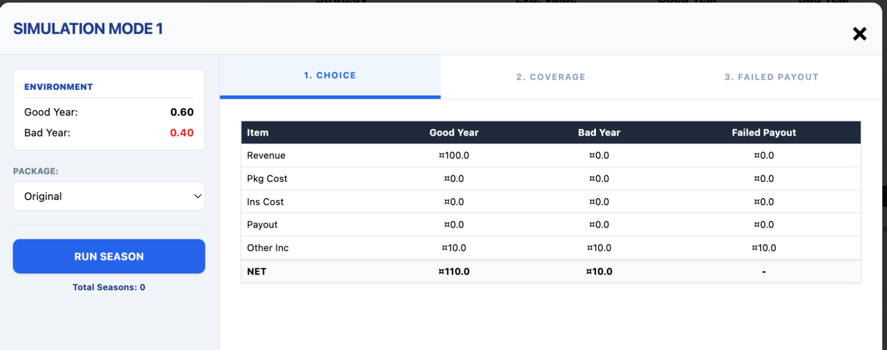

# 4b. Stress-Testing AA and Adaptation Under Climate Change

## 2. Scoping Analysis of Adaptation and AA Potential

### 2.1 Scoping Analysis Tool User Guide

**Access the tool here: [https://ccsfist.github.io/mrcs\_scoping/](https://ccsfist.github.io/mrcs_scoping/)**  

The Scoping Analysis Tool simulates the household economy of a typical community member deciding how to invest in adaptation. The subject has to make decisions about livelihood and risk mitigation investments in advance of the season, which has some probability of being either a good year (in which they receive returns to their livelihood investment) or a bad year (in which they don’t). The tool presents outcomes during a good year and a bad year, as well as the long-term average outcome (i.e., the expected value). 

The basic structure of this household economy model is identical to that presented in the previous section. This tool simplifies the model slightly, by collapsing non-farm income (e.g., savings, nature-based solutions) into a single “outside income” category and focusing on analysis of the enabling conditions for sustainable adaptation. 

The Scoping Analysis Tool has three parts. The center pane presents the key messages about the business model under consideration. The sliders on the left-hand pane allow the user to adjust the parameters of the business model and explore how the key messages change. Finally, the “Simulate Strategy” button allows the user to put the parameters of the chosen business model into a risk scenario that could be presented to communities, which we will discuss further in the following section. 

*The Key Messages*

The top of the page shows the key messages about this business model. The first is whether investing in improved livelihoods and (if applicable) insurance would result in a higher income on average. The second is whether the subject would have enough income during bad years to break even. The third is the insurance premium for the policy under consideration.

Below the key messages, the center pane shows a summary table of the outcomes under each combination of strategies \- investing in improved inputs vs not, and purchasing insurance vs not. The tables below show a detailed breakdown of the costs and benefits under each strategy. This includes the scenario in which there is a bad year, but the insurance fails to pay out (i.e., basis risk). 

*The Household Economy Model Parameters*

The left-hand pane allows the user to adjust each of the parameters of the household economy model, and observe how outcomes change. This can be used to test the sensitivity of a given adaptation theory of change to various assumptions. The functioning of each parameter is described below, using the case of farming as an example:

* **Good Year Base Value:** The value of income from a good harvest year, in units of local currency. This determines the rest of the numbers used in the scenario. Unless specified otherwise, all other parameters are expressed as percentages of the base value (with the equivalent value in currency units shown in blue above the respective slider).  
* **Improved Cost:** The cost of improved inputs.  
* **Yield Gain:** The improvement in income in a good year from improved inputs.  
* **Typical Payout:** The value of an insurance payout during bad years.   
* **Loading Fee:** The additional cost of purchasing insurance, reflecting fees and capital costs. Expressed as a percentage of the pure risk premium (i.e., typical payout \* prob. of bad year).  
* **Outside Savings:** The value of non-farm sources of income (which could include savings, nature-based solutions, etc.)  
* **Bad Year Prob.:** The probability of a bad weather year.   
* **Failed Payout Prob.:** The probability that insurance will fail to pay out, conditional on it being a bad weather year. 

*The Risk Scenario Simulator*

To translate the parameters of the chosen business model into a scenario exercise that could be played with communities, press the “Simulate Strategy” button on the bottom left-hand side of the screen. You will see a “Simulation” pop-up like the one above.

This simulation is broken into three rounds, following a simplified version of the structure discussed yesterday. Each round introduces an additional increment of complexity in the choices the player faces. 

* Round 1: Choice \- The user chooses whether or not to take out a loan to invest in improved inputs.  
* Round 2: Coverage \- The user faces two choices: a) Whether or not to invest in improved inputs (same as round 1), and b) whether or not to purchase weather insurance.  
* Round 3: Failed Payout \- The same choices as Round 2, but with the added complexity that insurance may fail to pay out during some bad years (basis risk).

Use the “Package” and “Insurance” dropdowns on the left-hand side to toggle between each of players’ choice options (invest in inputs vs not, buy insurance vs not). 

Press the “Run Season” option to simulate a seasonal outcome, using the probabilities of a good and bad year determined in the Parameters pane (shown in the top left hand corner of the Simulation pane for reference). Repeated runs of the season will result in different outcomes. This can be used to simulate possibilities when discussing the risk scenarios with communities.

To move from round to round, press the buttons on the center top part of the pane. To close out of the Simulation pane, press the X in the top right. 

*Customizing the Tool*

You can change any of the text in the parameter boxes by mousing over it, deleting the text that is currently there, and writing your own. This allows you to customize the business model to different contexts, e.g. pastoralists instead of farmers. You can also customize the title and key message text.

To save your customizations, along with the chosen parameter values, press the “Save Current Version” button on the bottom left hand side of the screen. This will allow you to save the current customized version of the scoping analysis tool as an .html file. 

### 2.2 Exploring & Refining Scoping Analysis 

**Using this framework, we can assess the enabling conditions for the community-led adaptation strategies we discussed on day 1\.** 

**This is a form of feasibility analysis for different adaptation options.** 

 

